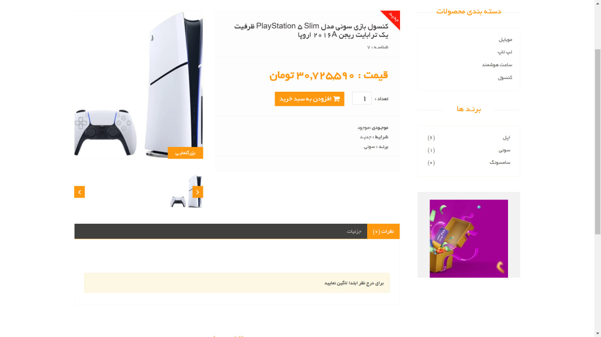
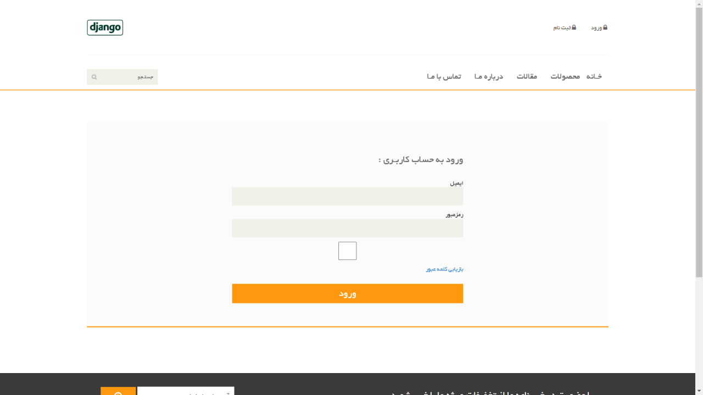

# Django Ecommerce Store  
A fully functional e-commerce website built with Django using MVT ueature.  

## Features  
✅ User authentication (Signup/Login)  
✅ Product listing with categories  
✅ Shopping cart & checkout system  
✅ Order history & user profile  
✅ Admin panel for product management
✅ Add Review
✅ Regester with email 

## Screenshots  
### 🛍️ Home Page  
 
  

### Product page
  

### Login page
  

### articles page
  

### 🔹 Installation  
1. Clone the repository:  
2. Install dependencies:  pip install -r requirements.txt
3. Run migrations:  python manage.py makemigrations and python manage.py migrate
4. Create a superuser:  python manage.py createsuperuser
5. Start the server:  python manage.py runserver

